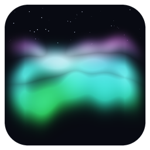
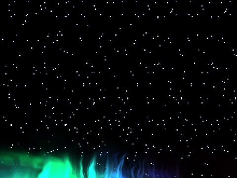
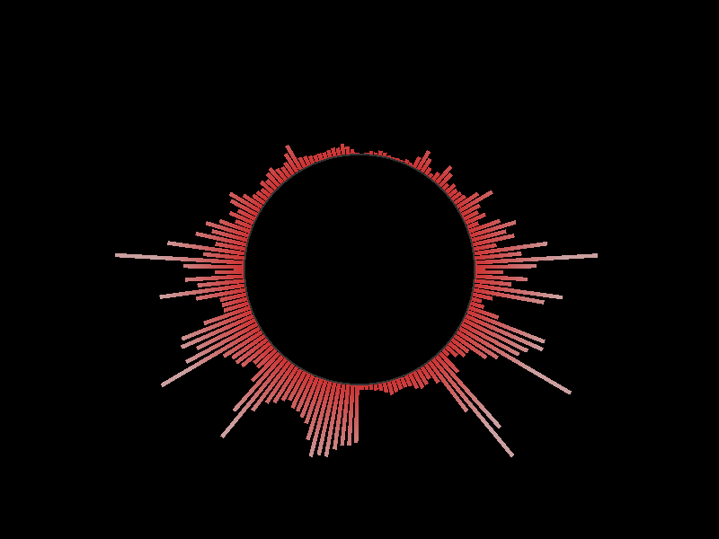
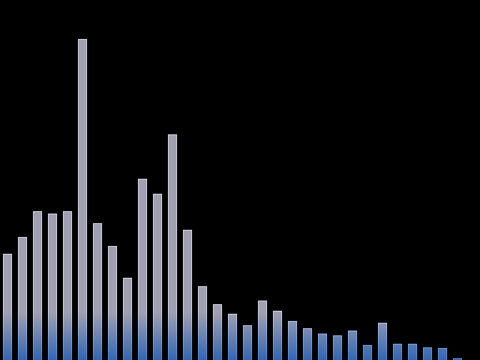
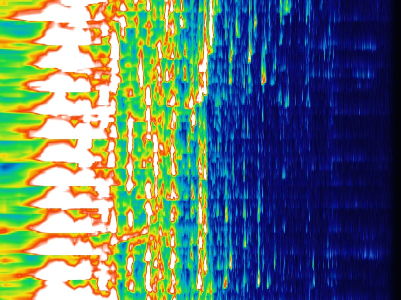

<p align="center">
  
</p>

<h1 align="center">GlavaSharp</h1>
<p align="center"><i>Turns whatever's playing on your speakers into light.</i></p>

GlavaSharp listens to your system audio and turns it into a live OpenGL
visualizer — spectrum bars, a radial burst, a scrolling heat-mapped
spectrogram, or a slow-drifting aurora that can sit pinned behind your
desktop icons like ambient wallpaper. It's a from-scratch C#/.NET
rebuild of [GLava](https://github.com/jarcode-foss/glava)'s rendering
model, because GLava's shader ecosystem (the module/`rc.glsl`/`#request`
convention) is genuinely well designed and deserved a home on a more
portable, memory-safe host.

**Status: early alpha.** It runs, it renders, and the core pipeline is
solid — but this is a project still finding its edges, not a polished
GLava replacement yet. See
**[TECHNICAL.md's status checklist](TECHNICAL.md#status--roadmap)** for
the honest, warts-and-all breakdown of what's done, what's shaky, and
exactly how every known quirk was (or wasn't yet) fixed.

> GlavaSharp is an independent reimplementation and is not affiliated
> with or endorsed by the GLava project.

---

## See it in action

### `aurora` — the one we're proudest of

Not part of GLava at all — a GlavaSharp original, built for people who
just want something calm and pretty breathing on their desktop. Soft
curtains of color rise and fold like the real northern lights, driven by
a curl-noise flow field with no clock or timer anywhere in the pipeline —
every bit of motion is the audio, re-sampling its own history, forever.

<p align="center">
  
</p>

<sub>(driven by real music, not synthetic noise — this is what it
actually looks like breathing)</sub>

### ...and the rest of the family

<table>
<tr>
<td align="center" width="34%">
  <br/>
  <sub><b>radial</b> — a circular burst, GLava's own</sub>
</td>
<td align="center" width="34%">
  <br/>
  <sub><b>bars</b> — the classic, GLava's own</sub>
</td>
<td align="center" width="34%">
  <br/>
  <sub><b>waterfall</b> — a scrolling spectrogram, GlavaSharp original</sub>
</td>
</tr>
</table>

Plus `circle`, `graph`, and `wave` straight from GLava's own tree — see
[What it does](#what-it-does) below for the full lineup.

---

## What it does

- Audio-reactive OpenGL visualizer — captures whatever's playing via
  PipeWire and feeds a live FFT spectrum into a GLSL shader chain, every
  frame.
- Runs GLava's own shader modules essentially unmodified: `bars`,
  `radial`, `circle`, `graph`, `wave` — same `rc.glsl`/module-directory
  convention GLava uses, same shader files.
- Plus two modules GLava doesn't have: **`waterfall`**, a scrolling,
  color-mapped spectrogram (frequency history over time), and **`aurora`**,
  the calming ambient visualizer above.
- Two interchangeable FFT backends: a CPU FFT (default, works everywhere)
  and a GPU compute-shader FFT (`--fft-device gpu`).
- Perceptual frequency bucketing (`--freq-scale log2|mel|bark|erb|linear`,
  default `log2`) — redistributes the raw FFT spectrum onto a scale that
  matches how humans actually resolve pitch, before any module sees it.
  Without this, most of a track's audible energy is crammed into a handful
  of the lowest raw bins, which reads as bass looking static/underused and
  the sparser high end looking disproportionately "active" — see
  TECHNICAL.md for the full writeup.
- Runs on both X11 and Wayland sessions (GLFW picks whichever the session
  is actually running).
- **Desktop-embedded mode** (`--desktop`, GLava's `-d` equivalent) —
  renders pinned behind desktop icons via X11 EWMH hints, transparent and
  click-through. Covers the whole (multi-monitor) screen by default;
  `--desktop-geometry X,Y,W,H` or `--desktop-monitor <index>`
  (`--list-monitors` to see indices) constrain it to an exact rect or a
  single monitor. Verified working on XFCE/xfwm4; GNOME and native
  Wayland aren't implemented yet.
- GPU picker for hybrid-graphics laptops (`--list-gpus` / `--gpu <n>`).
- Builds as a self-contained Native AOT executable — no installed .NET
  runtime needed. Its own build output (`build/dist/`) isn't a single file
  though: `libglfw.so.3.3`/`libglfw-wayland.so.3.3` (dynamically linked,
  unlike the Rust audio/X11 shims, which *are* statically linked) and
  `shaders/` ship alongside it. `cmake --build build --target appimage`
  packs all of that into one actual single-file `.AppImage` — see
  [Building](#building) below.

## Building

Requires: .NET 10 SDK, a Rust toolchain (via [rustup](https://rustup.rs)),
`clang`/`libclang-dev`, and `libpipewire-0.3-dev`. On Ubuntu:

```bash
sudo apt install dotnet-sdk-10.0 libpipewire-0.3-dev pkg-config clang libclang-dev cmake
```

Then:

```bash
cmake -S . -B build
cmake --build build
# -> build/dist/GlavaSharp (+ libglfw*.so + shaders/ alongside it)
```

For an actual single file to hand someone else, pack that into an AppImage
(needs `squashfs-tools`; fetches `appimagetool` from GitHub on first run,
cached under `build/tools/` afterwards):

```bash
cmake --build build --target appimage
# -> build/GlavaSharp-x86_64.AppImage
```

See [TECHNICAL.md](TECHNICAL.md#building-detailed) for building each
piece independently, cleaning, and why a plain `dotnet build` alone can't
run the app end-to-end.

## Running

```bash
./build/dist/GlavaSharp                    # default sink monitor, bars module from rc.glsl
./build/dist/GlavaSharp --module waterfall # scrolling spectrogram
./build/dist/GlavaSharp --list-sinks       # see capture targets
./build/dist/GlavaSharp --list-gpus        # see DRM render nodes (for --gpu)
./build/dist/GlavaSharp --fft-device gpu   # run the FFT on the GPU instead of the CPU
./build/dist/GlavaSharp --freq-scale erb   # try a different perceptual scale (default: log2)
./build/dist/GlavaSharp --desktop          # desktop-embedded mode (X11/xfwm4), whole screen
./build/dist/GlavaSharp --list-monitors    # see connected monitors (for --desktop-monitor)
./build/dist/GlavaSharp --desktop --desktop-monitor 1                  # ...on just monitor 1
./build/dist/GlavaSharp --desktop --desktop-geometry 100,100,800,600   # ...at a specific rect
./build/dist/GlavaSharp --desktop --module aurora                      # calming ambient desktop visualizer
```

See the top of `src/GlavaSharp/Program.cs` for the full CLI flag
reference, or [TECHNICAL.md](TECHNICAL.md) for how each piece actually
works under the hood.

## License

This project is licensed under the MIT License. See the LICENSE file for the full license text.

The bundled shader tree under `src/GlavaSharp/shaders/glava/` originates
from GLava and remains subject to its own license. See the original GLava
project for the licensing terms that apply to those files.
